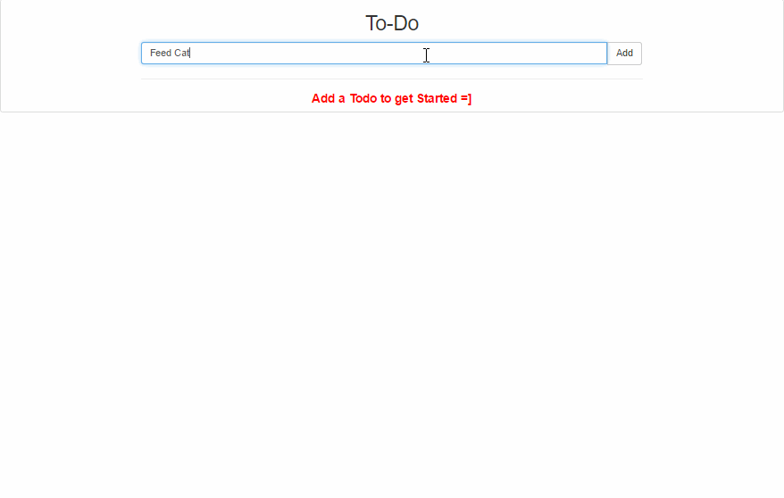

# react-firebase-todo
> ✏️ Todo App



---

### NOTE ✋ ⚠️  This uses `React14` with `ES5` & `gulp` , use it for reference purpose, upgrading to `React 15.*` with `ES2017` & `webpack` is planned for future
---


## Getting Started 🚀

* ```$ git clone https://github.com/ragmha/react-firebase-todo```

* ```$ yarn```

* ```$ yarn start -s```


## License
[MIT](./license) © [Raghib Hasan](http://raghibm.com/)